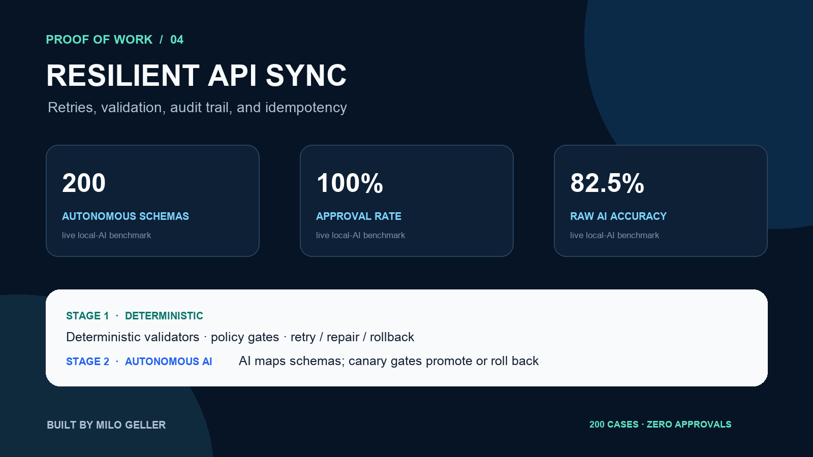

# Autonomous API Mapping & Synchronization



[](https://github.com/Milo318/resilient-api-sync-poc/actions/workflows/ci.yml)

A proof of concept for safely synchronizing contact records between two API-style systems. It normalizes data, validates required fields, paginates records, retries transient failures, uses idempotency keys, and leaves a structured audit trail.

**Public repository:** https://github.com/Milo318/resilient-api-sync-poc

> **Data notice:** both API systems and every contact are deterministic mocks. Addresses use the reserved `.test` domain and do not identify real people or organizations.

## Autonomous AI proof

The upgraded workflow lets a live model map unfamiliar source schemas to a canonical CRM contract. A deterministic validator enforces existing fields and one-to-one mappings, transforms five canary records, validates identity and email fields, and then promotes or rolls back the mapping automatically.

The committed [live-model benchmark](proof/autonomous-benchmark.json) and [200 case-level decisions](proof/autonomous-cases.jsonl) were generated with `granite4.1:3b` through Ollama:

> **How to read 100%:** the model alone mapped 165 of 200 schemas correctly. The final 200 of 200 result belongs to the complete system after structural validation, 35 automatic mapping repairs, and canary execution. Expected mappings are used for scoring only, not supplied to the runtime controller.

| Autonomous acceptance check | Result |
|---|---:|
| Independent source schemas | 200 |
| Raw AI mappings correct | 165 / 200 |
| Automatic mapping repairs | 35 |
| Distractor-field stress schemas | 100 / 100 approved |
| Canary records transformed and validated | 1,000 |
| Final machine-approved cases | 200 / 200 |
| Final system approval rate | **100%** |
| Human approvals | **0** |

```bash
python -m api_sync.autonomous_benchmark --cases 200 --model granite4.1:3b
```

Reproduction requires a running Ollama service with the selected model installed.

Half of the schemas contain reordered fields plus realistic billing-email, legacy-company, display-name, and fax distractors. Approval requires an exact match to the disclosed schema truth plus a successful canary transformation. The live model never receives direct write authority; the policy-controlled sync engine retains idempotency, retries, audit logs, and rollback behavior.

## Proof of work

The [committed benchmark](proof/benchmark.json) creates a controlled 1,000-record synchronization scenario:

| Check | Measured result |
|---|---:|
| Source records | 1,000 |
| Existing target records | 500 |
| Created / updated / unchanged | 500 / 250 / 250 |
| Synthetic transient failures recovered | 8 |
| Failures after retries | 0 |
| Writes during full replay | 0 |
| Idempotent replay | 100% |
| Automated tests | 7 passing |

The throughput value in the JSON is a local in-memory measurement; real APIs are network-bound. The meaningful proof is behavioral: injected failures recover, the audit counts reconcile to 1,000, and replay produces no duplicate writes.

### Reproduce the evidence

```bash
python3 -m venv .venv
source .venv/bin/activate
python -m pip install -e .
python -m unittest discover -s tests -v
python -m api_sync.cli
python -m api_sync.benchmark --records 1000
```

The demo writes the resulting target state to `output/synced_contacts.json` and a per-record audit log to `output/audit_log.json`.

## How it works

```text
Paginated source records
        ↓
Required-field and email validation
        ↓
Normalization + content fingerprint
        ↓
Compare with target
        ├── identical → skip
        └── changed/new → idempotent upsert → retry transient failures
                                      ↓
                                  audit event
```

### Stage 1 — deterministic core

The engine separates normalization, comparison, mutation, retry handling, and auditing. Idempotency keys combine the external ID with a content fingerprint, making each intended version addressable. Invalid data is rejected before any write.

### Stage 2 — autonomous AI integration setup

When two systems use unfamiliar field names, AI proposes one canonical `target field -> source field` mapping. The autonomous controller validates it, runs a canary transformation, and promotes or rolls back automatically before the deterministic sync begins.

```python
from api_sync.ai import suggest_field_mapping
mapping = suggest_field_mapping(source_fields, target_fields, sample_records)
```

This keeps AI outside the critical write loop: it helps configure the integration but does not decide whether a record is valid or whether a write succeeded.

## Evidence map

- [`data/mock/`](data/mock/) — labeled source and target contact fixtures
- [`tests/test_sync.py`](tests/test_sync.py) — create/update/skip, retry, replay, and rejection tests
- [`proof/benchmark.json`](proof/benchmark.json) — controlled 1,000-record scenario
- [`proof/autonomous-benchmark.json`](proof/autonomous-benchmark.json) — live-model schema acceptance summary
- [`proof/autonomous-cases.jsonl`](proof/autonomous-cases.jsonl) — all 200 mapping decisions
- [`proof/portfolio-card.png`](proof/portfolio-card.png) — portfolio-ready evidence image
- [GitHub Actions workflow](.github/workflows/ci.yml) — fresh verification on every push

## Production extension points

A production adapter would add real HTTP clients, OAuth/token refresh, vendor rate-limit headers, persistent checkpoints, encrypted secrets, dead-letter handling, monitoring, and the client's conflict-resolution policy.

Built by **Milo Geller** · MIT licensed.
